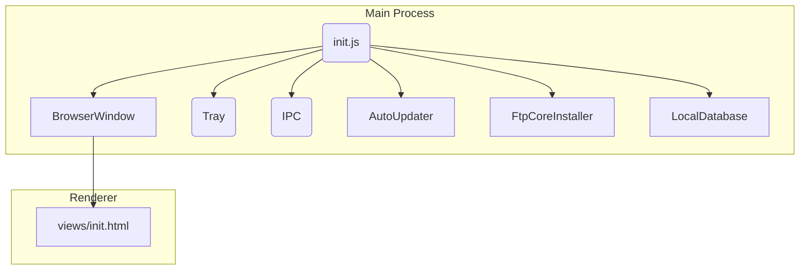

# ftp‑manager‑2022 📂🔌

> **ftp‑manager‑2022** — настольный FTP‑клиент на базе **Electron 19**. Приложение позволяет хранить список соединений локально, подключаться к удалённым серверам через встроенный исполняемый модуль *FtpCore.exe* и автоматически обновляться с CDN. Разработка прекращена, а репозиторий переведён в **архив**: публикуется *as‑is*, без дальнейших исправлений или новых функций.

---

## ⚡ Возможности

* **Кроссплатформенный UI** на Electron с кастомным заголовком окна и поддержкой тёмной темы.
* **Локальная база данных** (`LocalDatabase/`) — хранит конфигурации подключений в JSON‑файлах внутри каталога приложения AppData.
* **Трей‑меню** и сворачивание в область уведомлений (модуль `startupMenu`).
* **Автоматические обновления**: проверка новой версии на CDN, скачивание `app.asar` и перезапуск («горячее» обновление).
* **Автоматическая установка FTP‑ядра** (`FtpCoreInstaller`) при первом запуске.
* **Асинхронные загрузки** файлов через `nodejs-file-downloader` с индикатором прогресса.

---

## 📦 Структура проекта

| Путь / файл                   | Назначение                                                                                 |
| ----------------------------- | ------------------------------------------------------------------------------------------ |
| `init.js`                     | Точка входа Electron. Создаёт `BrowserWindow`, обрабатывает IPC‑события и стартует модули. |
| `views/`                      | HTML‑шаблоны интерфейса (`init.html`) и скрипты (`scripts/preload.js`).                    |
| `LocalDatabase/`              | Мини‑ORM: `Database.js`, `Document.js`, `index.js`. Управляет JSON‑хранилищем подключений. |
| `modules/AutoUpdater`         | Логика автообновления: запрос версии, скачивание `app.asar`, подмена и перезапуск.         |
| `modules/FtpCoreInstaller.js` | Загрузка бинарного ядра **FtpCore.exe** с CDN, если отсутствует.                           |
| `modules/startupMenu.js`      | Формирование системного трэя и контекстного меню.                                          |
| `icons/`                      | Иконки приложения (`ftp.ico`, `ftp.png`, `ftp_icon.png`).                                  |

---

## 🚀 Быстрый старт (разработчика)

```bash
# 1. Клонирование
git clone https://github.com/Shiro-nn/ftp-manager-2022.git
cd ftp-manager-2022

# 2. Установка зависимостей
npm install

# 3. Запуск в режиме dev
npm start                # или electron .
```

*Требуется Node.js >= 18. Для Windows создан бинарь ****\`FTPCore.exe\`****, Linux‑версии нет.*

### 🔧 Сборка дистрибутива

```bash
npm run package          # создаёт ./dist с готовым .exe
```

---

## 🗺️ Мини‑архитектура



---

## 🛠️ Зависимости

* **Electron 19**
* **original‑fs**, **appdata‑path** — работа с файловой системой и каталогом AppData.
* **nodejs‑file‑downloader**, **request** — сетевые загрузки и HTTP‑запросы.
* **unzipper** — распаковка архивов (при обновлении).

---

## 🤝 Вклад

Репозиторий **заморожен**. Патчи принимаются только для критических уязвимостей. Хотите продолжить проект — делайте форк.

---

## ⚖️ Лицензия

Исходный код распространяется под лицензией **MIT** (см. `LICENSE`).

> Спасибо, что заглянули! Надеемся, этот архив окажется полезен в ваших проектах.
